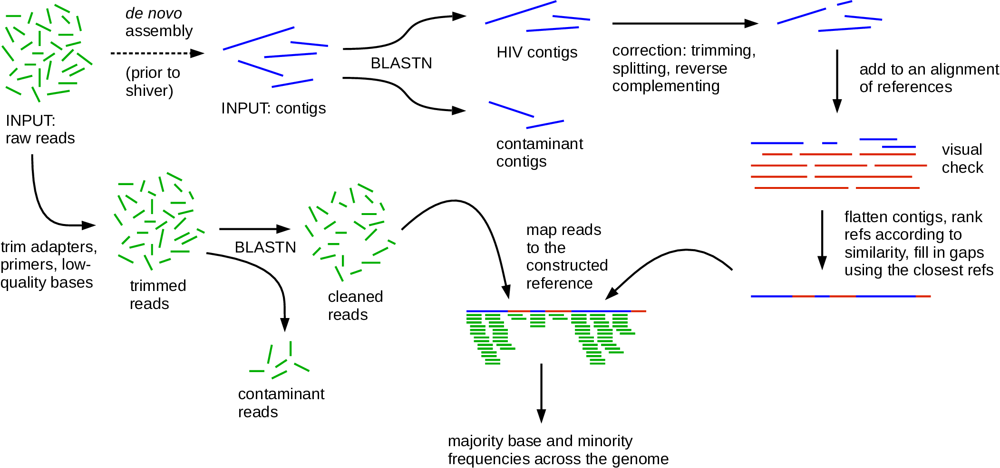

# shiver
Sequences from HIV Easily Reconstructed.  

<p align="center"></p>

shiver is freely available under the GNU General Public License version 3, described [here](LICENSE).  
shiver is a tool for mapping paired-end short reads to a custom reference sequence constructed using _de novo_ assembled contigs, in order to minimise the biased loss of information that occurs from mapping to a reference that differs from the sample.
From the mapped reads, base frequencies are calculated, and a consensus sequence is called.  
The method, its performance and scientific context are discussed [here](https://doi.org/10.1093/ve/vey007); please cite this if you find shiver, or our discussion of the relevant issues, helpful.
If you use shiver, please also cite its dependencies. Citation details [here](info/CitationDetails.bib).

shiver runs natively on Linux and Mac OS, but not Windows.
However on any operating system (including Windows), if you have [VirtualBox](https://www.virtualbox.org/wiki/Downloads) installed, you can run [this](https://www.dropbox.com/sh/j3pmmunhxlc7g1w/AABddPfc5dN9oVnP9vQfAZOta?dl=0) image of Ubuntu Linux 16.04.3 which contains shiver, our separate tool [phyloscanner](https://github.com/BDI-pathogens/phyloscanner) (which allows you to investigate the within- and between-host diversity in mapped reads produced e.g. by shiver), all of their dependencies, and also the assembler [SPAdes](http://cab.spbu.ru/software/spades/) which can be used to assemble contigs suitable as input for shiver.  

## dependencies
shiver dependencies: [Fastaq](https://github.com/sanger-pathogens/Fastaq), [samtools](http://www.htslib.org/), [biopython](http://biopython.org/wiki/Download), [mafft](http://mafft.cbrc.jp/alignment/software/), [blast](https://blast.ncbi.nlm.nih.gov/Blast.cgi?PAGE_TYPE=BlastDocs&DOC_TYPE=Download) version 2.2.28 or higher (warning: earlier versions of blast have a bug that prevents shiver from correcting contigs), [trimmomatic](http://www.usadellab.org/cms/?page=trimmomatic) (optional: needed if you want to trim reads for quality or adapter sequences) and at least one of [smalt](http://www.sanger.ac.uk/science/tools/smalt-0) or [BWA](http://bio-bwa.sourceforge.net/) or [bowtie](http://bowtie-bio.sourceforge.net/index.shtml) for mapping.
Manual installation instructions for all of these dependencies are [here](info/InstallationNotes.sh). Otherwise, installation can be simplified using `conda`:

```
# install miniconda3: https://docs.conda.io/en/latest/miniconda.html
# install mamba
conda install mamba -n base -c conda-forge

# change to Shiver directory, e.g. cd ~/shiver, then make shiver environment
mamba env create -f environment.yml

#activate the environment
mamba activate shiver
```

## manual
The shiver manual is [here](info/ShiverManual.pdf).
